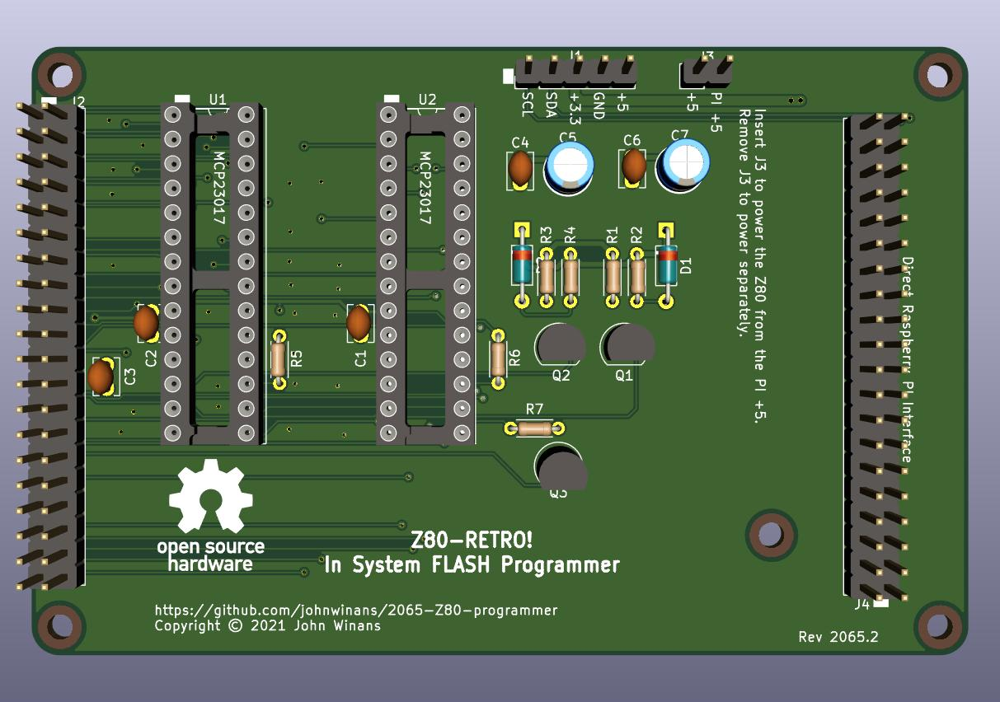

An in-circuit programmer for the FLASH on a [2063-Z80](https://github.com/johnwinans/2063-Z80) board.

* A youtube playlist discussing this project and how to build your own can be found in [John's Basement](https://www.youtube.com/watch?v=oekucjDcNbA&list=PL3by7evD3F51Cf9QnsAEdgSQ4cz7HQZX5)
* A PDF version of the schematic can be found [here](2065-Z80-programmer.pdf).
* Here is the as-built [BOM](2065-Z80-programmer.md) with links to the datasheets for all the parts.
* Here is another [BOM](2065-Z80-programmer-sockets.md) with links to sockets for the chips.
* A Raspberry PI application for this board can be found in the [pi](pi) directory.

